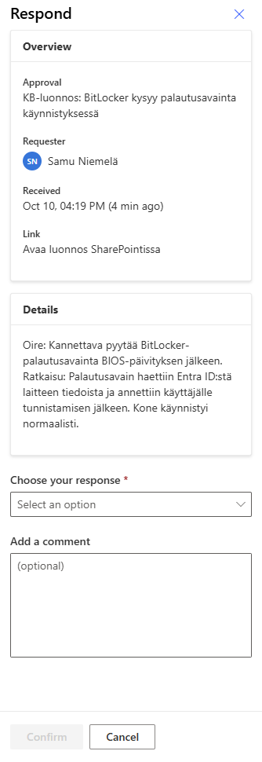
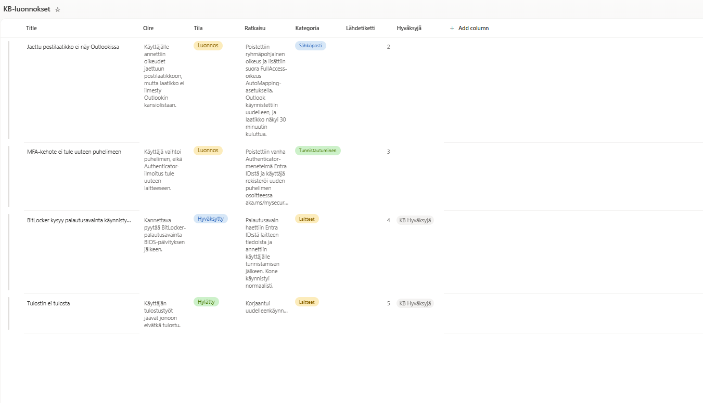
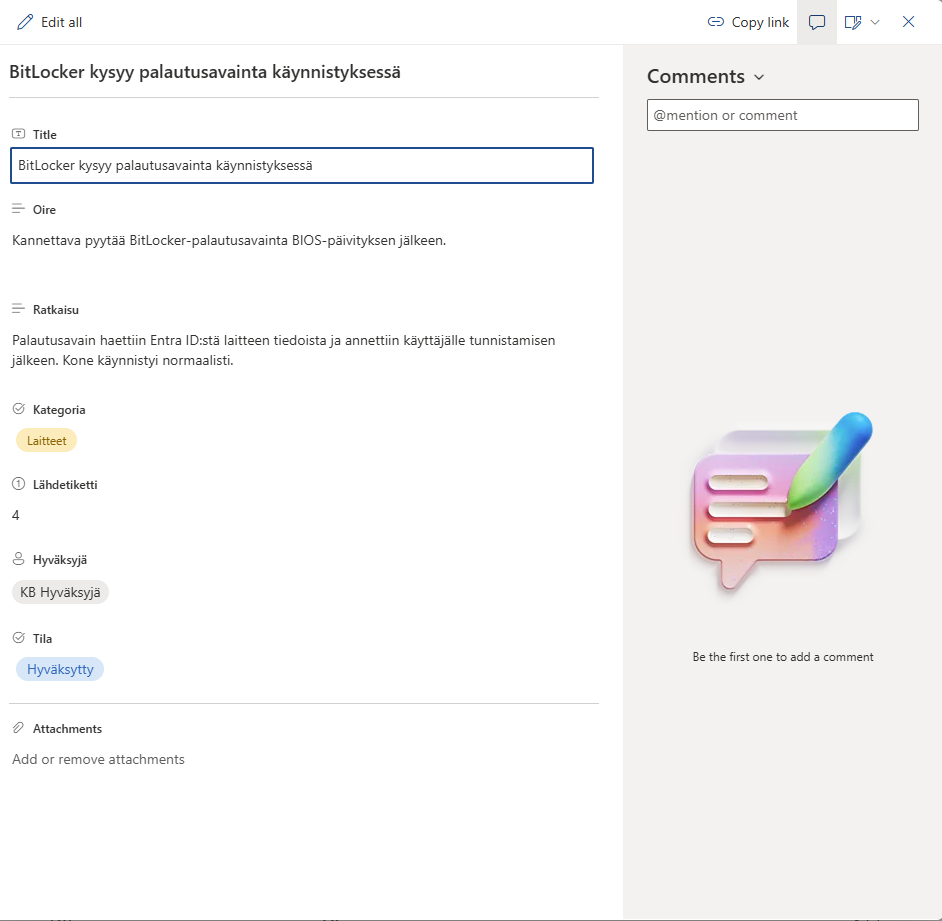
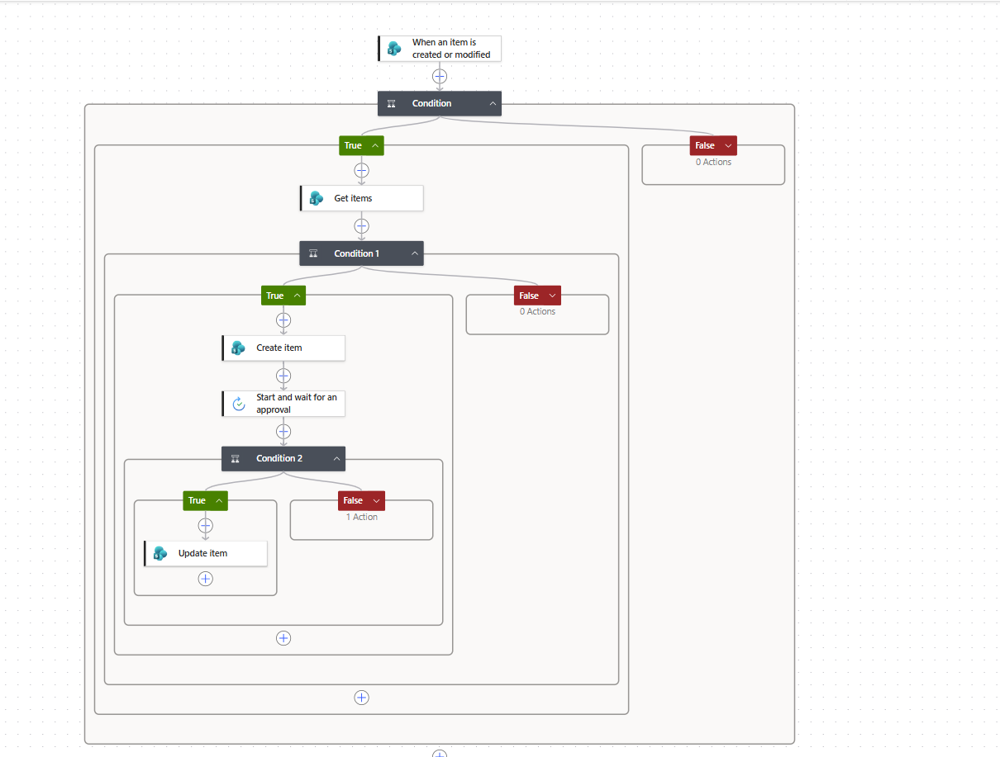
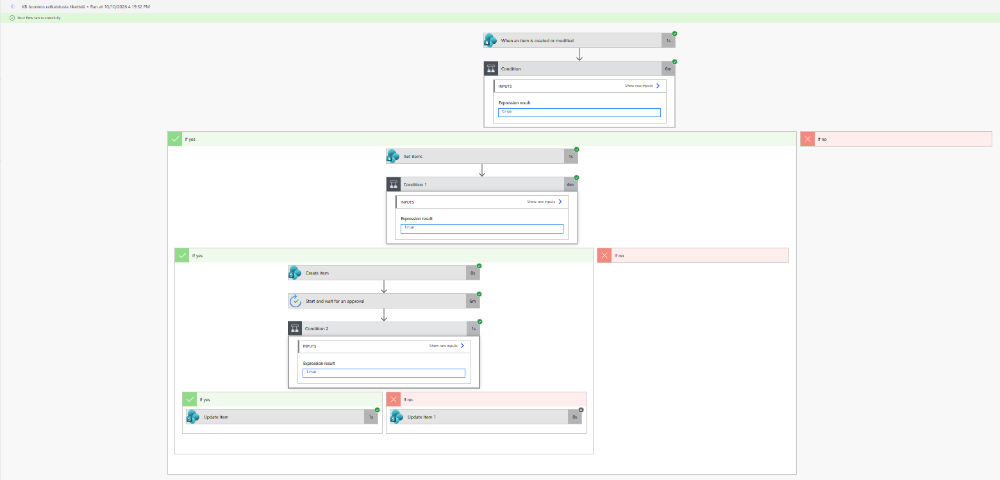

# Power Automate -versio: ratkaistusta tiketistä hyväksyttyyn ohjeeseen

Sama periaate kuin PowerShell-demossa, toteutettuna Microsoft 365:n vakiotyökaluilla: ratkaistusta tiketistä syntyy tietopankkiluonnos, ja se päätyy tietopankkiin vasta, kun ihminen hyväksyy sen.

> Rakennettu omaan Microsoft 365 -testiympäristöön. Kaikki data on keksittyä. Vain vakioliittimet (SharePoint, Approvals), ei premium-lisenssejä.

## Työnkulku

1. **Tukipyynnöt**-listan tiketin tilaksi vaihdetaan *Ratkaistu*.
2. Flow tarkistaa, onko tiketistä jo luonnos (suodatus lähdetiketin numerolla). Jos on, mitään ei tehdä.
3. **KB-luonnokset**-listaan luodaan luonnos: otsikko, oire, ratkaisu, kategoria ja lähdetiketti.
4. Hyväksyjälle lähtee hyväksyntäpyyntö (sähköposti / Teams / Power Automate), jossa on linkki luonnokseen.
5. Päätöksen mukaan luonnoksen tila päivittyy *Hyväksytty* tai *Hylätty*, ja hyväksyjä tallentuu luonnokseen.

## Rakenne

| Osa | Toteutus |
| --- | --- |
| Tukipyynnöt | SharePoint-lista: otsikko, kuvaus, ratkaisu, kategoria, tila (Avoin / Työn alla / Ratkaistu) |
| KB-luonnokset | SharePoint-lista: otsikko, oire, ratkaisu, kategoria, lähdetiketti, tila (Luonnos / Hyväksytty / Hylätty), hyväksyjä |
| Flow | When an item is created or modified → Condition → Get items → Condition → Create item → Start and wait for an approval → Condition → Update item |

## Huomioita toteutuksesta

- **Kaksoiskappaleiden esto.** Trigger laukeaa jokaisesta muokkauksesta. Ilman tarkistusta jo ratkaistun tiketin muokkaus loisi uuden luonnoksen. Flow hakee luonnokset suodattimella `Lahdetiketti eq <tiketin ID>` ja jatkaa vain, jos tuloksia on nolla.
- **Sarakkeiden sisäiset nimet ilman ääkkösiä.** SharePoint muodostaa sisäisen nimen luontihetkellä, ja ä muuttuu muotoon `_x00e4_`. Sarakkeet luotiin nimillä *Lahdetiketti* ja *Hyvaksyja*, ja näkyvä nimi vaihdettiin jälkikäteen. Suodattimet ja lausekkeet pysyvät luettavina.
- **Viittaukset lausekkeina.** Luonnoksen tunniste, otsikko ja hyväksyjän sähköposti annetaan lausekkeina (esim. `outputs('Create_item')?['body/ID']`). Kun kenttä valitaan Get items -vaiheen dynaamisesta sisällöstä, editori lisää automaattisesti For each -silmukan, eikä luonnosta luoda lainkaan, kun aiempia luonnoksia ei ole.
- **Luku vs. teksti vertailussa.** Ehto `length(...) = 0` toimii vain, kun myös `0` annetaan lausekkeena. Tekstinä annettu "0" ei ole sama kuin luku 0.

## Rajoitukset

- Flow'ssa ei ole AI-vaihetta. Tekstin tuottaminen tekoälyllä vaatisi Power Automatessa premium-liittimen tai AI Builder -krediittejä. AI-vaihe on toteutettu PowerShell-demossa (Claude API ja anonymisointi).
- SharePoint-trigger tarkistaa muutokset ajoittain, joten flow käynnistyy 1–5 minuutin viiveellä.
- Hyväksyntä odottaa enintään 30 päivää, minkä jälkeen ajo päättyy aikakatkaisuun.
